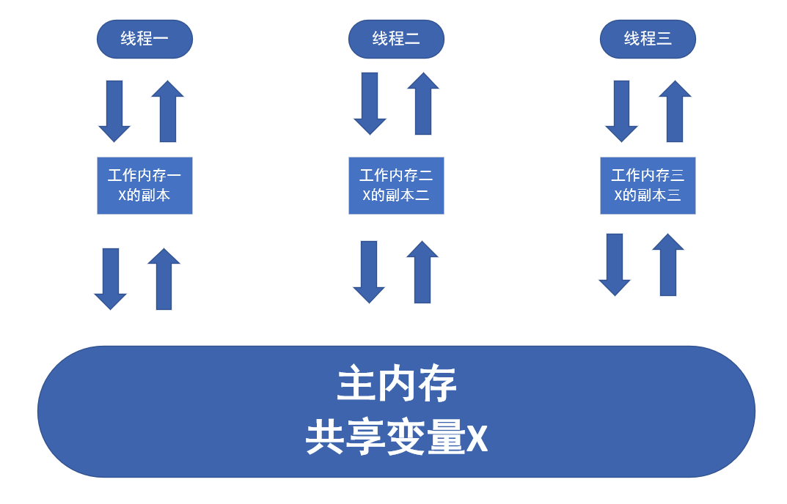

#JAVA
1. new出来的对象，基本类型为初始值，String类型为"null"，Object为null
2. 接口调用时，使用BeanCopy，在对象类型不同时，不能copy
3. spring的BeanUtils.copyProperties()在对象类型不同时，会复制为键值对HashMap
4. list遍历删除时，使用迭代器进行删除
##内存可见性和原子性：Synchronized和Volatile的比较
[参考文章](https://blog.csdn.net/guyuealian/article/details/52525724)  
###Java内存模型
1. Java中所有变量都存储在主内存中
2. 每个线程都有自己独立的工作内存，里面保存该线程使用到的变量副本（副本的主内存中该变量的拷贝）  

###Synchronized和Volatile的比较:  
a. Synchronized保证内存可见性和操作的原子性  
b. Volatile只能保证内存可见性  
c. Volatile不需要加锁，比Synchronized更轻量级，并不会阻塞线程（volatile不会造成线程的阻塞；synchronized可能会造成线程的阻塞。）  
b. volatile标记的变量不会被编译器优化,而synchronized标记的变量可以被编译器优化（如编译器重排序的优化）  
d. volatile是变量修饰符，仅能用于变量，而synchronized是一个方法或块的修饰符。  
>volatile本质是在告诉JVM当前变量在寄存器中的值是不确定的，使用前，需要先从主存中读取，因此可以实现可见性。而对n=n+1,n++等操作时，volatile关键字将失效，不能起到像synchronized一样的线程同步（原子性）的效果。